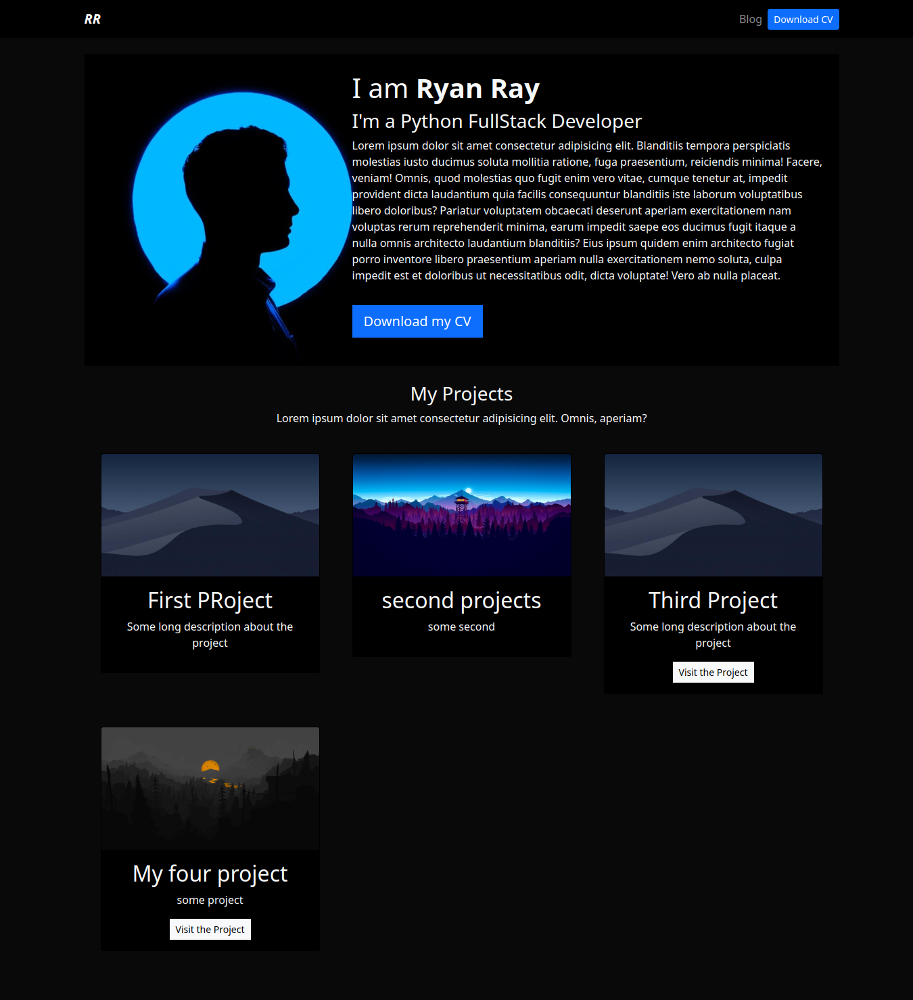

## Django Portofolio Example

this is a basic portfolio in dark mode


### Installation

```
git clone https://github.com/FaztWeb/django-portfolio-simple.git
cd django-portfolio-simple
pip install -r requirements.txt
python manage.py runserver
```

now you can visit <a href="http://localhost:8000" target="_blank">http://localhost:8000</a>